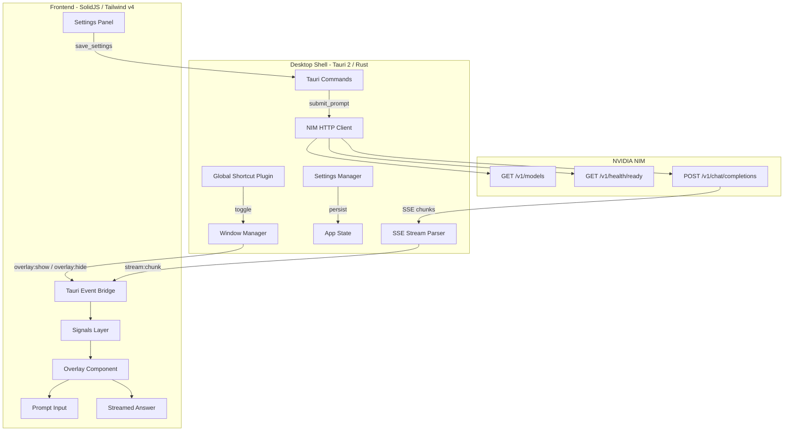

# particle0 — Full Implementation Plan

## Architecture Overview

particle0 is a Windows desktop AI overlay assistant with a Spotlight-like interaction model. A global hotkey summons a compact floating window, the user types a prompt, the app streams the answer from NVIDIA NIM, and the overlay dismisses instantly.



---

## Confirmed Decisions

| Decision | Choice |
|---|---|
| CSS Framework | Tailwind CSS v4 with custom design tokens |
| Conversation Mode | Default single-turn, toggle for multi-turn |
| System Tray | Deferred (not in V1) |
| Multi-Monitor | Overlay appears on the monitor where the mouse cursor currently is |
| Testing | Rust-side unit tests for critical paths |
| Packaging | Windows installer (NSIS), no auto-updater in V1 |

---

## Phase 0: Project Bootstrap

**Goal**: Scaffold the Tauri 2 + SolidJS + Tailwind v4 project, establish the full directory structure, and verify the dev loop works (frontend hot-reload + Tauri window opens).

### 0.1 Scaffold Tauri 2 Project

Use `create-tauri-app` (or `npm create tauri-app@latest`) with the SolidJS + TypeScript template. This generates the dual-root structure: frontend at `./` and Rust at `./src-tauri/`.

Key `Cargo.toml` dependencies to add beyond the scaffold default:
- `tauri` (with features: `devtools` for dev builds)
- `reqwest` (with `stream`, `json`, `rustls-tls` features) for NIM HTTP calls
- `serde` + `serde_json` for config and API serialization
- `tokio` (full features) for async runtime
- `futures` for stream combinators
- `thiserror` for error types
- `uuid` for request IDs

Key `package.json` dependencies:
- `solid-js`
- `@tauri-apps/api` (v2)
- `@tauri-apps/plugin-global-shortcut`
- `@tauri-apps/plugin-store` (for settings, decided later)
- `tailwindcss` (v4)
- `@tailwindcss/vite` (v4 Vite plugin)
- `solid-markdown` or `marked` + `DOMPurify` (for answer rendering)

### 0.2 Configure Tailwind CSS v4

Tailwind v4 uses a CSS-first configuration model. Design tokens go in `src/styles/globals.css` using `@theme`:

```css
@import "tailwindcss";

@theme {
  --color-surface: oklch(0.15 0.01 260);
  --color-surface-elevated: oklch(0.20 0.01 260);
  --color-border: oklch(0.30 0.01 260);
  --color-text-primary: oklch(0.95 0 0);
  --color-text-secondary: oklch(0.65 0 0);
  --color-accent: oklch(0.70 0.15 250);
  --color-error: oklch(0.65 0.20 25);
  --color-success: oklch(0.70 0.18 145);
  --radius-overlay: 12px;
  --shadow-overlay: 0 8px 32px oklch(0 0 0 / 0.5);
}
```

Light theme overrides applied via a `[data-theme="light"]` selector or media query.

### 0.3 Establish Directory Structure

Create the full project tree as specified in the original plan:

```
particle0/
├── index.html
├── package.json
├── tsconfig.json
├── vite.config.ts
├── .env.example
├── README.md
├── src/
│   ├── main.tsx
│   ├── App.tsx
│   ├── components/
│   │   ├── Overlay.tsx
│   │   ├── PromptInput.tsx
│   │   ├── StreamedAnswer.tsx
│   │   ├── StatusBar.tsx
│   │   ├── ErrorView.tsx
│   │   └── SettingsPanel.tsx
│   ├── signals/
│   │   ├── overlay.ts
│   │   ├── session.ts
│   │   └── settings.ts
│   ├── lib/
│   │   ├── tauri-events.ts
│   │   ├── tauri-commands.ts
│   │   ├── api-types.ts
│   │   └── format.ts
│   ├── styles/
│   │   ├── globals.css
│   │   └── overlay.css
│   └── vite-env.d.ts
└── src-tauri/
    ├── tauri.conf.json
    ├── Cargo.toml
    ├── build.rs
    ├── icons/
    ├── capabilities/
    │   ├── default.json
    │   └── overlay.json
    └── src/
        ├── main.rs
        ├── lib.rs
        ├── window_manager.rs
        ├── shortcut.rs
        ├── nim_client.rs
        ├── stream_parser.rs
        ├── commands.rs
        ├── settings.rs
        ├── state.rs
        └── errors.rs
```

### 0.4 Verify Dev Loop

Run `cargo tauri dev` and confirm: Vite HMR works, a Tauri window opens showing SolidJS content, Rust `println!` reaches the terminal.

---

## Phase 1: Desktop Shell and Window Management

**Goal**: Configure the overlay window with exact frameless, always-on-top, centered behavior. Register the global hotkey. Wire the toggle cycle.

### 1.1 Configure `tauri.conf.json` Window

Set the overlay window properties:

```json
{
  "label": "overlay",
  "title": "particle0",
  "width": 780,
  "height": 120,
  "minWidth": 780,
  "minHeight": 80,
  "maxHeight": 720,
  "resizable": false,
  "decorations": false,
  "transparent": true,
  "alwaysOnTop": true,
  "visible": false,
  "center": true,
  "skipTaskbar": true,
  "shadow": false
}
```

`transparent: true` enables the glass/matte card aesthetic via CSS. `shadow: false` because the CSS `box-shadow` on the overlay container handles the visual shadow (native shadows on transparent frameless windows behave inconsistently on Windows).

### 1.2 Build `window_manager.rs`

This module owns all overlay window operations. It does NOT decide when to show/hide — it executes commands from the shortcut handler or Tauri commands.

Functions:
- `show_overlay(app: &AppHandle)` — get window by label "overlay", detect the monitor under the current cursor position using `app.cursor_position()` + `available_monitors()`, compute center coordinates for that monitor, call `set_position()`, then `show()`, then `set_focus()`.
- `hide_overlay(app: &AppHandle)` — call `hide()` on the overlay window. Emit `overlay:hide` event.
- `toggle_overlay(app: &AppHandle)` — check `is_visible()`. If hidden: `show_overlay`. If visible and focused: `hide_overlay`. If visible but not focused: `set_focus()`.
- `resize_overlay(app: &AppHandle, height: f64)` — set new logical height for the window, clamped to min/max thresholds.

Multi-monitor logic detail: `app.cursor_position()` returns the global cursor `PhysicalPosition`. Iterate `available_monitors()`, find which monitor's bounds contain that position, then compute `(monitor.position.x + (monitor.size.width - window_width) / 2, monitor.position.y + monitor.size.height * 0.2)` to place the overlay at roughly 20% from the top of that monitor.

### 1.3 Define Capabilities

`src-tauri/capabilities/overlay.json`:

```json
{
  "identifier": "overlay-capability",
  "description": "Permissions for the overlay window",
  "windows": ["overlay"],
  "permissions": [
    "core:window:allow-show",
    "core:window:allow-hide",
    "core:window:allow-set-focus",
    "core:window:allow-set-size",
    "core:window:allow-set-position",
    "core:window:allow-is-visible",
    "core:window:allow-center",
    "core:event:default",
    "global-shortcut:allow-register",
    "global-shortcut:allow-unregister",
    "global-shortcut:allow-is-registered"
  ]
}
```

### 1.4 Build `shortcut.rs`

Register the global shortcut on app startup using `tauri_plugin_global_shortcut`.

- Default shortcut: `Alt+Space`
- On activation: call `toggle_overlay`
- On failure to register: log warning, set a `hotkey_registered: false` flag in app state, surface it later in settings UI
- Expose `re_register_shortcut(new_shortcut: String)` so settings can change the hotkey at runtime (unregister old, register new, update config)

### 1.5 Wire App Startup in `main.rs` / `lib.rs`

```rust
fn main() {
    tauri::Builder::default()
        .plugin(tauri_plugin_global_shortcut::Builder::new().build())
        .setup(|app| {
            // Initialize app state
            // Register global shortcut
            // Load settings
            // Start background NIM validation (Phase 3)
            Ok(())
        })
        .invoke_handler(tauri::generate_handler![/* commands */])
        .run(tauri::generate_context!())
        .expect("error while running tauri application");
}
```

---

## Phase 2: UI Shell and Theming

**Goal**: Build the complete overlay UI skeleton with all regions, theming, and layout transitions — wired to placeholder signals, not yet connected to real data.

### 2.1 Overlay Container (`Overlay.tsx`)

The root overlay component. Sets up the card container with:
- Rounded corners (`rounded-xl`)
- Background blur/glass effect via `backdrop-blur-md` + semi-transparent background
- CSS box-shadow for the floating drop shadow
- A vertical flex layout: Header -> PromptInput -> StreamedAnswer -> Footer
- CSS `transition` on `height` for smooth expansion between collapsed/streaming/completed states

### 2.2 Prompt Input (`PromptInput.tsx`)

A `<textarea>` with auto-resize behavior:
- Starts as single-line height
- Grows up to 3 lines as the user types (use `scrollHeight` measurement)
- Beyond 3 lines, internal scroll activates
- Placeholder text: "Ask anything..."
- Submit on `Enter` (when not Shift-held)
- `Shift+Enter` inserts newline
- `Escape` handling: if streaming -> cancel; if idle/completed -> dismiss overlay
- Visual submit button on the right side (arrow icon), disabled during streaming

### 2.3 Streamed Answer (`StreamedAnswer.tsx`)

- Initially hidden (collapsed state)
- When streaming begins, the region appears with a smooth height transition
- Content area renders markdown-lite (paragraphs, code blocks, inline code, bullet lists)
- Use `solid-markdown` (wraps `remark`) or build a minimal custom renderer with `marked` + `DOMPurify`
- Streaming cursor: a blinking `|` or `_` appended to the last token during streaming state
- When content exceeds max height (~480px), the answer area becomes scrollable while input stays pinned at top
- Auto-scroll to bottom during streaming, but if user manually scrolls up, pause auto-scroll

### 2.4 Header Strip

- Minimal: small app icon/logo on the left
- Status dot: green (connected), yellow (connecting), red (error), gray (not configured)
- Settings gear icon on the right — opens settings panel
- Optional expand/collapse button if content is scrollable

### 2.5 Footer Row

- Visible only in `completed` or `streaming` state
- **Copy** button: copies the full answer text to clipboard
- **Clear** button: resets session to idle
- **Close** button: hides overlay
- **Model indicator**: small text showing the active model name
- **Multi-turn toggle**: a small switch/button to enable conversation memory (default off)

### 2.6 Theme System

Three modes: dark (default), light, follow-system.

Implementation approach:
- `[data-theme="dark"]` and `[data-theme="light"]` on the root `<html>` element
- Tailwind v4 `@theme` block defines the dark palette as default
- Light overrides in a `@media (prefers-color-scheme: light)` block or a `[data-theme="light"]` selector
- Follow-system uses `window.matchMedia("(prefers-color-scheme: dark)")` listener to toggle the attribute
- The theme preference is stored in settings and applied on app load via Rust emitting a `settings:updated` event

### 2.7 Height State Machine (CSS)

Three overlay height states managed by a signal:

- **Collapsed** (~80px): input only, no answer region visible
- **Streaming** (~280-480px): input + growing answer region
- **Completed** (~280-480px): input + full answer + footer

Transitions use CSS `max-height` + `transition: max-height 200ms ease-out` on the answer container. The Tauri window itself is resized from Rust (`resize_overlay`) when the frontend emits height change requests via a command.

---

## Phase 3: NIM Integration and Settings Persistence

**Goal**: Build the Rust NIM HTTP client, settings storage, and the startup validation pipeline.

### 3.1 Define Settings Schema (`settings.rs`)

```rust
#[derive(Debug, Clone, Serialize, Deserialize)]
pub struct AppSettings {
    pub nim_base_url: String,      // e.g. "http://localhost:8000"
    pub nim_api_key: String,       // stored locally, never logged
    pub nim_model: String,         // e.g. "meta/llama-3.1-8b-instruct"
    pub hotkey: String,            // e.g. "Alt+Space"
    pub theme: ThemePreference,    // Dark | Light | System
    pub launch_on_startup: bool,
    pub max_tokens: Option<u32>,   // optional cap
    pub temperature: f32,          // default 0.7
    pub request_timeout_secs: u64, // default 30
    pub overlay_width: u32,        // default 780
}
```

Persistence: write to a JSON file at `app_data_dir()/particle0/settings.json` using `serde_json`. Load on startup, create with defaults on first run. Validate before applying (e.g., URL must parse, temperature 0.0-2.0).

**Why a raw JSON file over Tauri Store plugin**: the settings struct is typed and validated in Rust before being applied. A Rust-managed file gives full control over validation, migration, and atomic writes. Tauri Store is better suited for unstructured frontend-side preferences.

### 3.2 Build `nim_client.rs`

The NIM client struct:

```rust
pub struct NimClient {
    http: reqwest::Client,
    base_url: String,
    api_key: String,
    model: String,
    timeout: Duration,
}
```

Methods:
- `new(settings: &AppSettings) -> Self` — construct with reqwest Client (reuse across requests)
- `list_models() -> Result<Vec<ModelInfo>, NimError>` — `GET {base_url}/v1/models`, parse the `data` array
- `check_health() -> Result<bool, NimError>` — `GET {base_url}/v1/health/ready`, return true if 200
- `chat_completion_stream(messages: Vec<ChatMessage>, temperature: f32, max_tokens: Option<u32>) -> Result<impl Stream<Item = Result<StreamChunk, NimError>>, NimError>` — `POST {base_url}/v1/chat/completions` with `stream: true`, returns an async stream of parsed chunks

Request headers:
- `Authorization: Bearer {api_key}`
- `Content-Type: application/json`
- `Accept: text/event-stream` (for streaming)

### 3.3 Build `errors.rs`

```rust
#[derive(Debug, thiserror::Error)]
pub enum NimError {
    #[error("NIM server unreachable: {0}")]
    NetworkError(String),
    #[error("Authentication failed: check your API key")]
    AuthError,
    #[error("Model '{0}' not found on this endpoint")]
    ModelNotFound(String),
    #[error("Request timed out after {0}s")]
    Timeout(u64),
    #[error("Stream parse error: {0}")]
    StreamParseError(String),
    #[error("Server error: {0}")]
    ServerError(String),
    #[error("Configuration error: {0}")]
    ConfigError(String),
}
```

Implement `Into<tauri::InvokeError>` so these errors can be returned directly from Tauri commands.

### 3.4 Startup Validation Pipeline

In `setup()`:
1. Load settings from disk
2. If settings are incomplete (no base URL or API key) -> set `backend_state = NotConfigured`, skip validation
3. If settings exist -> spawn an async task:
   a. Call `check_health()` — if fails, set `backend_state = Unreachable`
   b. Call `list_models()` — if configured model is not in list, set `backend_state = ModelMissing`
   c. If all pass, set `backend_state = Ready`
4. Emit `backend:ready` or `backend:unavailable` event to frontend

### 3.5 Build `state.rs`

Centralized app state using `tauri::Manager` + `Mutex<AppState>`:

```rust
pub struct AppState {
    pub settings: AppSettings,
    pub backend_status: BackendStatus, // Ready | Unreachable | ModelMissing | NotConfigured
    pub hotkey_registered: bool,
    pub active_request_id: Option<String>,
    pub overlay_visible: bool,
    pub conversation_history: Vec<ChatMessage>, // for multi-turn mode
    pub multi_turn_enabled: bool,
}
```

---

## Phase 4: Streaming Pipeline

**Goal**: Build the SSE parser, connect streaming chunks from Rust to the frontend, and render progressive output.

### 4.1 Build `stream_parser.rs`

NIM's streaming response uses SSE format (Server-Sent Events). Each line is:

```
data: {"id":"...","choices":[{"delta":{"content":"token"},...}],...}

data: [DONE]
```

The parser:
- Reads the `reqwest::Response` body as a byte stream
- Splits on `\n\n` boundaries
- Strips `data: ` prefix
- Ignores lines starting with `:` (SSE comments)
- Detects `[DONE]` as stream termination
- Deserializes each JSON payload into a `StreamChunk` struct
- Extracts `choices[0].delta.content` as the token text
- Yields `StreamChunk { token: String, finish_reason: Option<String> }`

Batching: accumulate tokens for ~16ms before emitting to the frontend to avoid per-token re-renders. Use a simple timer or a small buffer that flushes on either 16ms elapsed or buffer reaching ~5 tokens.

### 4.2 Emit Streaming Events to Frontend

Event contract (Rust -> Frontend):

- `stream:start { request_id: String }` — emitted when the HTTP connection opens and the first byte arrives
- `stream:chunk { request_id: String, token: String, accumulated: String }` — emitted per batch with both the delta and the full accumulated text so far
- `stream:end { request_id: String, full_text: String, elapsed_ms: u64, token_count: u32 }` — emitted when `[DONE]` is received
- `stream:error { request_id: String, error: String, error_type: String }` — emitted on any failure

### 4.3 Frontend Signal Wiring (`signals/session.ts`)

```typescript
export const [sessionState, setSessionState] = createSignal<SessionState>("idle");
export const [streamedText, setStreamedText] = createSignal("");
export const [promptText, setPromptText] = createSignal("");
export const [errorInfo, setErrorInfo] = createSignal<ErrorInfo | null>(null);
export const [requestMeta, setRequestMeta] = createSignal<RequestMeta | null>(null);
```

Listen to Rust events in `tauri-events.ts`:
- On `stream:start` -> `setSessionState("streaming")`, `setStreamedText("")`
- On `stream:chunk` -> `setStreamedText(event.payload.accumulated)`
- On `stream:end` -> `setSessionState("completed")`, store metadata
- On `stream:error` -> `setSessionState("failed")`, `setErrorInfo(...)`

### 4.4 Cancel Stream

Tauri command `cancel_prompt`:
- Set a cancellation flag in `AppState` (or use a `tokio::sync::watch` channel)
- The streaming loop checks this flag on each iteration
- On cancel: drop the `reqwest` response (aborts the connection), set session state to `cancelled`, emit `stream:end` with partial text

Frontend: `Escape` key during streaming calls `invoke("cancel_prompt")`.

### 4.5 Connect `StreamedAnswer.tsx` to Real Data

- Subscribe to `streamedText()` signal
- Parse markdown on each update using the chosen renderer
- Render incrementally (SolidJS fine-grained reactivity means only the text node updates, not the entire DOM tree)
- Append blinking cursor during `streaming` state
- Auto-scroll logic: track `scrollTop` vs `scrollHeight`, only auto-scroll if user hasn't manually scrolled up

---

## Phase 5: Session Orchestration and Conversation Memory

**Goal**: Implement the full prompt lifecycle state machine and the optional multi-turn conversation mode.

### 5.1 Prompt Lifecycle State Machine (Rust-side)

States: `Idle -> Queued -> Connecting -> Streaming -> Completed | Failed | Cancelled`

Implement in `commands.rs` as the `submit_prompt` Tauri command:

```
1. Receive prompt string from frontend
2. Validate: non-empty after trim, backend status is Ready
3. Generate request_id (UUID v4)
4. Set state to Queued, store active_request_id
5. Build messages array:
   - If multi-turn enabled: prepend conversation_history
   - Always append { role: "user", content: prompt }
6. Set state to Connecting
7. Call nim_client.chat_completion_stream(messages, temperature, max_tokens)
8. On connection success: set state to Streaming, emit stream:start
9. Loop over stream chunks:
   - Check cancellation flag each iteration
   - Accumulate tokens
   - Batch-emit stream:chunk events
10. On stream complete:
    - Set state to Completed
    - If multi-turn: append user message + assistant response to conversation_history
    - Emit stream:end with metadata
11. On error at any step: set state to Failed, emit stream:error
```

### 5.2 Multi-Turn Conversation Memory

Data structure in `AppState`:

```rust
pub conversation_history: Vec<ChatMessage>,  // { role: "user"|"assistant", content: String }
pub multi_turn_enabled: bool,
```

When multi-turn is ON:
- Each successful exchange appends both the user message and assistant response to `conversation_history`
- The next prompt sends the full history as the `messages` array
- A "Clear" action resets `conversation_history` to empty

When multi-turn is OFF (default):
- Each prompt sends only `[{ role: "user", content: prompt }]`
- No history is stored

The toggle is controlled by a frontend signal and synced to Rust via a command `set_multi_turn(enabled: bool)`.

### 5.3 Request Deduplication

Prevent rapid repeated submits:
- `submit_prompt` checks if `active_request_id` is already set
- If a request is active, the command returns an error `"A request is already in progress"`
- Frontend disables the submit button when `sessionState()` is `queued | connecting | streaming`

---

## Phase 6: Settings Panel and First-Run Experience

**Goal**: Build the settings UI, connection test flow, model selector, hotkey editor, and the first-run onboarding.

### 6.1 Settings Panel (`SettingsPanel.tsx`)

A slide-in panel or a full overlay replacement. Fields:

- **NIM Base URL**: text input, validated as a parseable URL
- **API Key**: password-type input with show/hide toggle
- **Model**: dropdown, populated by `list_models()` response after successful connection test
- **Hotkey**: a key capture input — user presses the desired key combination, the app records it
- **Theme**: three-option selector (Dark / Light / System)
- **Temperature**: slider 0.0-2.0, default 0.7
- **Max Tokens**: optional number input
- **Launch on Startup**: toggle switch
- **Test Connection**: button that triggers the validation flow
- **Reset to Defaults**: button with confirmation
- **Save**: persists all changes

### 6.2 Test Connection Flow

When user clicks "Test Connection":
1. Frontend calls `invoke("test_connection", { base_url, api_key })`
2. Rust creates a temporary `NimClient` with the provided credentials
3. Calls `check_health()` — shows "Server reachable" or "Server unreachable"
4. Calls `list_models()` — returns model list to populate the dropdown
5. Returns `{ success: bool, models: Vec<String>, error: Option<String> }`
6. Frontend shows success/failure indicator and populates model selector

### 6.3 Hotkey Editor

A custom input component:
- User clicks "Change Hotkey" button
- Input enters "listening" mode with visual indicator ("Press your shortcut...")
- Captures the next key combination via `keydown` event
- Displays the captured combo (e.g., "Ctrl+Shift+Space")
- On save, calls `invoke("update_hotkey", { shortcut })` which:
  - Unregisters the old shortcut
  - Attempts to register the new one
  - If registration fails (collision), returns error and reverts
  - If success, updates settings

### 6.4 First-Run Onboarding

Detection: on app startup, if `settings.json` doesn't exist or `nim_base_url` is empty:

1. Overlay opens automatically showing the Settings Panel in "setup mode"
2. Step-by-step guided fields: URL -> API Key -> Test Connection -> Select Model -> Choose Hotkey -> Done
3. The "Done" button validates all fields, saves settings, starts the startup validation pipeline, and transitions to the normal overlay state
4. After setup: overlay hides, app enters background-ready state waiting for the hotkey

### 6.5 Launch on Startup

When enabled, register the app to start with Windows:
- Use Tauri's `tauri_plugin_autostart` plugin or manually add a registry entry via Rust
- `tauri_plugin_autostart` is the cleaner approach — add to `Cargo.toml` and capabilities
- When the toggle is changed in settings, enable/disable autostart accordingly

---

## Phase 7: Edge Cases, Error Handling, and Polish

**Goal**: Handle every edge case from the plan, refine keyboard behavior, tune performance, and achieve the quality targets.

### 7.1 Edge Case Handling

**Hotkey collision**: if `register_shortcut` fails, set `hotkey_registered: false` in app state, show a yellow status dot and a warning in settings: "Shortcut `Alt+Space` is already in use. Choose another."

**Hidden window but active stream**: when the user hides the overlay while streaming:
- The stream continues in the background (Rust-side)
- `overlay_visible` is set to false but the stream loop keeps running
- When the user re-opens (hotkey), the latest `streamedText` signal value is immediately displayed
- No re-fetch needed

**App starts without internet**: startup validation fails at `check_health()`. Set `backend_status = Unreachable`. The overlay still opens on hotkey, but submitting shows: "Cannot reach the model server. Check your connection and NIM settings." Settings remain accessible.

**Invalid model configured**: startup validation succeeds on health check but configured model is missing from `/v1/models`. Set `backend_status = ModelMissing`. Show: "Selected model is not available on this endpoint. Open Settings to pick a valid model."

**Rapid repeated submits**: `submit_prompt` command guards against `active_request_id.is_some()`. Frontend also disables submit via signal state.

**Large response burst**: stream parser batches tokens every ~16ms before emitting events. SolidJS fine-grained reactivity inherently handles this well since it updates only the text node, not the whole DOM subtree.

**Long text in prompt**: textarea grows to max 3 lines (~72px), then activates `overflow-y: auto` for internal scrolling.

**App relaunch during prior incomplete state**: on startup, `active_request_id` is always `None` (transient state, not persisted). `conversation_history` is also cleared on restart (only in-memory). Clean `Idle` state is guaranteed.

### 7.2 Error UX

Every error keeps the overlay visible and preserves the prompt text. Error messages are shown in the answer region with:
- A red/orange accent bar on the left
- Human-readable message (not raw HTTP errors)
- A "Retry" button that re-submits the same prompt
- A "Settings" link if the error is configuration-related

Error mapping from `NimError` to user-facing strings:
- `NetworkError` -> "Cannot reach the model server."
- `AuthError` -> "Authentication failed. Check your API key in Settings."
- `ModelNotFound` -> "Selected model is not available."
- `Timeout` -> "Request timed out. Try again or increase timeout in Settings."
- `StreamParseError` -> "Response was corrupted. Try again."
- `ServerError` -> "The model server returned an error."
- `ConfigError` -> "Configuration issue. Open Settings to fix."

### 7.3 Keyboard Behavior Refinement

Full keymap:
- `Enter` — submit (when not streaming, when input has content)
- `Shift+Enter` — newline in input
- `Escape` — if streaming: cancel stream. If idle/completed: hide overlay
- `Ctrl+A` — select all text in input
- `Ctrl+C` — copy selected text (or if nothing selected and answer is visible, copy answer)
- `Ctrl+L` — clear session (reset to idle)
- `Tab` — does not leave the input (trapped focus within the overlay)

### 7.4 Performance Targets

- Overlay visible in < 150ms after hotkey (warm app): achieved by keeping the window pre-created and only toggling visibility, not creating/destroying it
- Input focused immediately: `set_focus()` on the window + frontend `onMount(() => inputRef.focus())`
- First visible token as early as network allows: Rust begins emitting `stream:chunk` events as soon as the first SSE data line is parsed
- Smooth streaming: SolidJS signal updates + Tailwind utility classes (no complex CSS recalculations)

### 7.5 Clipboard Integration

"Copy" button in the footer copies the full answer text using the Tauri clipboard API:
- Add `tauri-plugin-clipboard-manager` to dependencies
- Add clipboard permissions to capabilities
- Frontend calls `writeText(streamedText())`

### 7.6 Window Resize Synchronization

When the content height changes (answer starts streaming, answer grows, answer completes):
1. Frontend measures the content height via a `ResizeObserver` on the overlay container
2. Frontend calls `invoke("resize_overlay", { height })` with the desired logical pixel height
3. Rust calls `window.set_size(LogicalSize::new(width, height))` clamped to min/max
4. This keeps the Tauri window tightly wrapped around the content

---

## Phase 8: Testing, Building, and Packaging

**Goal**: Write Rust unit tests for critical paths, build the production binary, and package as a Windows installer.

### 8.1 Rust Unit Tests

Test files alongside source modules (Rust convention):

**`nim_client.rs` tests**:
- Test request body construction (correct model, messages, stream flag)
- Test error mapping from HTTP status codes (401 -> AuthError, 404 -> ModelNotFound, 500 -> ServerError, timeout -> Timeout)
- Test model list parsing from mock JSON response

**`stream_parser.rs` tests**:
- Test parsing a single SSE chunk with `data: {"choices":[{"delta":{"content":"Hello"}}]}`
- Test parsing multiple chunks in sequence
- Test handling of `data: [DONE]` termination
- Test handling of malformed SSE data (graceful error, not panic)
- Test handling of empty `delta.content` (some chunks have no content)

**`settings.rs` tests**:
- Test default settings creation
- Test settings serialization/deserialization roundtrip
- Test validation: invalid URL rejected, temperature out of range rejected
- Test settings file write and reload

**`errors.rs` tests**:
- Test all error variants produce correct display strings

Run with `cargo test` from the `src-tauri` directory.

### 8.2 Production Build

```bash
cargo tauri build
```

This produces a release binary with:
- Vite-built and minified frontend assets
- Rust compiled in release mode with optimizations
- Windows-specific resources (icon, manifest)

### 8.3 Windows Installer (NSIS)

Tauri 2 supports NSIS installer out of the box. Configure in `tauri.conf.json`:

```json
{
  "bundle": {
    "active": true,
    "targets": ["nsis"],
    "icon": ["icons/icon.ico"],
    "identifier": "com.particle0.app",
    "windows": {
      "nsis": {
        "installMode": "currentUser",
        "displayLanguageSelector": false
      }
    }
  }
}
```

This produces a `.exe` installer that:
- Installs to the user's local app directory
- Creates a Start Menu shortcut
- Registers uninstall entry in Windows settings
- Does NOT require admin privileges (`currentUser` mode)

---

## Improvement Suggestions Already Incorporated

1. **Tailwind v4 CSS-first config** over a JS config file — simpler, faster, native `@theme` tokens.
2. **Rust-managed settings file** over Tauri Store — better validation, migration support, typed struct.
3. **Token batching in stream parser** (~16ms) — prevents per-token re-renders, matches 60fps display refresh.
4. **Multi-monitor awareness** — overlay appears on the monitor where the cursor currently is, not just "centered."
5. **ResizeObserver + Rust window resize** — tight content-height synchronization rather than fixed height states.
6. **Conversation history as optional multi-turn** — gives the user control, defaults to stateless for speed.

## Additional Suggestions Worth Considering

- **Logging**: consider adding `tracing` + `tracing-subscriber` to the Rust side for structured logging. Logs can be written to `app_data_dir()/particle0/logs/` and rotated. This helps debug production issues without a debugger.
- **Graceful degradation for markdown rendering**: if the markdown parser fails on adversarial input, fall back to rendering raw text rather than crashing or showing nothing.
- **Rate limiting on the frontend**: if the user somehow bypasses the submit lock, add a 500ms debounce on the command invocation as a safety net.
