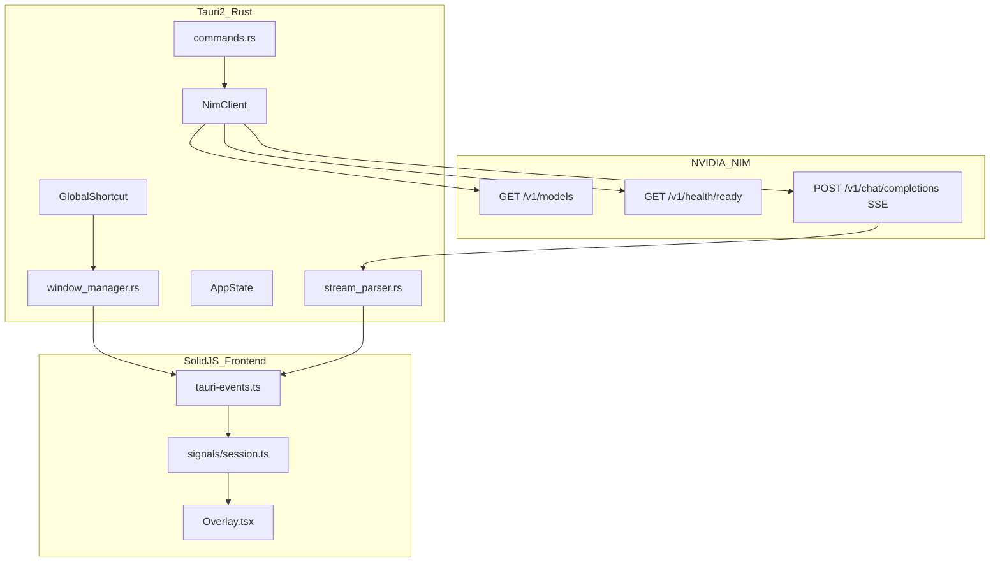

# particle0 Presentation Deck Plan

## Deliverable

A single Markdown file at [`PRESENTATION.md`](PRESENTATION.md) (repo root) structured as slide sections (`---` separators or `## Slide N` headers). Concise bullets per slide; deeper **Implementation Notes** subsections under each phase with code citations and deviations from the plan.

Reference sources:
- Original plan: [`.cursor/plans/particle0_implementation_plan_11a0e99b.plan.md`](.cursor/plans/particle0_implementation_plan_11a0e99b.plan.md)
- Product spec: [`particle0-plan.md`](particle0-plan.md)
- Developer guide: [`WALKTHROUGH.md`](WALKTHROUGH.md)
- App code: [`particle0/`](particle0/)

---

## Slide Deck Outline (all topics covered)

### Section 1 — Introduction (3 slides)

**Slide 1: Title**
- particle0 — Windows AI Overlay Assistant
- Version 0.1.0, Tauri 2 + Rust + SolidJS
- One-line pitch: Spotlight-style hotkey → type → stream answer from NVIDIA NIM

**Slide 2: What It Is**
- Desktop app (not a web service, no local ML)
- Global hotkey summons a frameless floating card
- Streams tokens in real time; dismisses instantly
- Windows-first (NSIS installer, registry autostart)

**Slide 3: User Promise** (from [`particle0-plan.md`](particle0-plan.md))
- Instant summon, immediate focus, live stream, minimal chrome, instant exit
- Optional multi-turn memory; dark/light/system themes

**Implementation note:** Repo layout is `particle0/particle0/` (nested app dir under git root). Docs live in `WALKTHROUGH.md`, not the template [`particle0/README.md`](particle0/README.md).

---

### Section 2 — Purpose & Problem (2 slides)

**Slide 4: Why particle0 Exists**
- AI answers without context-switching to a browser tab
- Overlay stays on top; works from any app
- NVIDIA NIM as managed inference (hosted or self-hosted OpenAI-compatible API)

**Slide 5: V1 Scope vs Deferred**
- **In V1:** overlay, streaming, settings, multi-turn toggle, autostart, NSIS
- **Deferred (explicit):** system tray, auto-updater, macOS packaging
- Design references in [`design-references/`](design-references/) are aesthetic inspiration only (not wired to code)

---

### Section 3 — Architecture (3 slides + mermaid)

**Slide 6: High-Level Architecture**



**Slide 7: Six Layers** (from product plan, mapped to files)
| Layer | Rust | Frontend |
|-------|------|----------|
| Desktop shell | `lib.rs`, `shortcut.rs`, capabilities | `App.tsx` |
| Window controller | `window_manager.rs` | ResizeObserver in `App.tsx` |
| Inference client | `nim_client.rs`, `stream_parser.rs` | — |
| Session orchestration | `commands.rs`, `state.rs` | `signals/session.ts` |
| UI rendering | — | `components/*` |
| Configuration | `settings.rs` | `SettingsPanel.tsx`, `signals/settings.ts` |

**Slide 8: IPC Contract**
- **15 invoke commands** (e.g. `submit_prompt`, `save_settings`, `resize_overlay`) — registered in [`lib.rs`](particle0/src-tauri/src/lib.rs)
- **12+ events** (e.g. `stream:chunk`, `backend:ready`, `overlay:show`) — wired in [`tauri-events.ts`](particle0/src/lib/tauri-events.ts)
- Rust owns persistence + network; frontend owns display state + animations

**Implementation note:** Window label is `"main"` (plan said `"overlay"`). Single capability file [`capabilities/default.json`](particle0/src-tauri/capabilities/default.json) (no separate `overlay.json`).

---

### Section 4 — Tech Stack (1 slide)

| Layer | Choice |
|-------|--------|
| Shell | Tauri 2 |
| Backend | Rust 2021 — tokio, reqwest, serde, uuid, thiserror |
| Frontend | SolidJS 1.9 + TypeScript 5.6 |
| Bundler | Vite 6 (dev port 1420) |
| CSS | Tailwind v4 (`@theme` tokens in [`globals.css`](particle0/src/styles/globals.css)) |
| AI | NVIDIA NIM REST (OpenAI-compatible) |
| Packaging | NSIS, `currentUser` install mode |

Plugins: `global-shortcut`, `clipboard-manager`, `opener`. Autostart via `winreg` (not `tauri_plugin_autostart`).

---

### Section 5 — Phase 0: Bootstrap (1 slide + notes)

**Planned:** Scaffold Tauri + SolidJS + Tailwind v4; directory tree; verify dev loop.

**Implementation notes:**
- Full tree matches plan under [`particle0/src/`](particle0/src/) and [`particle0/src-tauri/src/`](particle0/src-tauri/src/)
- Dev: `cd particle0 && npm install && npm run tauri dev`
- Release profile: size-optimized (LTO, strip) in `Cargo.toml`
- `.env.example` is dev reference only; runtime config is `settings.json`

---

### Section 6 — Phase 1: Desktop Shell (1 slide + notes)

**Planned:** Frameless overlay window, `window_manager.rs`, capabilities, global hotkey, toggle cycle.

**Implementation notes:**
- Window config in [`tauri.conf.json`](particle0/src-tauri/tauri.conf.json): 780×120, transparent, always-on-top, `shadow: false`
- **Deviation:** `visible: true` at startup (plan said hidden); first-run opens settings instead of staying hidden
- [`window_manager.rs`](particle0/src-tauri/src/window_manager.rs): cursor-monitor positioning at **18%** from top (plan said 20%); `toggle_overlay` = show / hide-if-focused / refocus
- [`shortcut.rs`](particle0/src-tauri/src/shortcut.rs): hotkey registration + `update_hotkey` for runtime change
- **Deviation:** default hotkey is `Ctrl+Space` in [`settings.rs`](particle0/src-tauri/src/settings.rs) defaults; `WALKTHROUGH.md` still says Alt+Space

---

### Section 7 — Phase 2: UI Shell & Theming (1 slide + notes)

**Planned:** Overlay, PromptInput, StreamedAnswer, header/footer, theme system, height states.

**Implementation notes:**
- [`Overlay.tsx`](particle0/src/components/Overlay.tsx): card layout — header (status dot + settings), input, answer, footer, status bar
- [`PromptInput.tsx`](particle0/src/components/PromptInput.tsx): auto-grow textarea, Enter submit, Escape handling
- [`StreamedAnswer.tsx`](particle0/src/components/StreamedAnswer.tsx): custom `renderMarkdown()` with HTML escape (not `solid-markdown` / DOMPurify as planned)
- [`StatusBar.tsx`](particle0/src/components/StatusBar.tsx) + [`ErrorView.tsx`](particle0/src/components/ErrorView.tsx): connection dot, metrics, retry UX
- Theme: `data-theme` on root via [`signals/settings.ts`](particle0/src/signals/settings.ts); tokens in `globals.css`
- Height: **ResizeObserver-driven** dynamic sizing (plan's 3-state CSS machine is secondary to live measurement)

---

### Section 8 — Phase 3: NIM Integration & Settings (1 slide + notes)

**Planned:** `nim_client.rs`, `settings.rs`, `errors.rs`, `state.rs`, startup validation.

**Implementation notes:**
- Settings schema matches plan in [`settings.rs`](particle0/src-tauri/src/settings.rs); persisted to `%APPDATA%/com.particle0.app/settings.json`
- [`nim_client.rs`](particle0/src-tauri/src/nim_client.rs): `check_health`, `list_models`, `chat_completion_stream`, plus **`probe_model()`** (extra step not in original plan)
- [`errors.rs`](particle0/src-tauri/src/errors.rs): `NimError` + `UserFacingError` for UI strings
- [`state.rs`](particle0/src-tauri/src/state.rs): adds `cancel_requested`, `Checking` backend status
- Startup validation in [`lib.rs`](particle0/src-tauri/src/lib.rs): health (404 tolerated) → models → model in list → **probe inference** → `backend:ready`

Default NIM URL: `https://integrate.api.nvidia.com/v1`

---

### Section 9 — Phase 4: Streaming Pipeline (1 slide + notes)

**Planned:** SSE parser, batched events, frontend signals, cancel stream, StreamedAnswer wired.

**Implementation notes:**
- [`stream_parser.rs`](particle0/src-tauri/src/stream_parser.rs): SSE `data:` lines, `[DONE]`, yields `StreamChunk`
- [`commands.rs`](particle0/src-tauri/src/commands.rs): **16ms token batching** before `stream:chunk` emit
- Events: `stream:start`, `stream:chunk`, `stream:end`, `stream:error`, **`stream:cancelled`** (implementation addition)
- [`tauri-events.ts`](particle0/src/lib/tauri-events.ts): `connecting` state on `stream:start`; first chunk → `streaming`
- Cancel: `cancel_requested` flag + `cancel_prompt` command; Escape in UI
- [`App.tsx`](particle0/src/App.tsx): ResizeObserver debounced 40ms → `resize_overlay(height, dpr)` with DPR fix for WebView2

---

### Section 10 — Phase 5: Session Orchestration (1 slide + notes)

**Planned:** Prompt lifecycle state machine, multi-turn memory, request deduplication.

**Implementation notes:**
- States: `idle → connecting → streaming → completed | failed | cancelled` (frontend); Rust guards `active_request_id`
- Multi-turn: `conversation_history` in Rust; capped at **40 messages** (`MAX_HISTORY_MESSAGES` in `commands.rs`)
- History is **in-memory only** — cleared on app restart
- `set_multi_turn`, `clear_history`, `get_turn_count` commands
- Dedup: Rust rejects if `active_request_id.is_some()`; UI disables submit while active

---

### Section 11 — Phase 6: Settings & Onboarding (1 slide + notes)

**Planned:** SettingsPanel, test connection, hotkey editor, first-run, launch on startup.

**Implementation notes:**
- [`SettingsPanel.tsx`](particle0/src/components/SettingsPanel.tsx): URL, API key, model dropdown, hotkey capture, theme, temperature, max tokens, autostart, test/save/reset
- `test_connection` → health + model list (no full probe in settings flow)
- First-run: [`App.tsx`](particle0/src/App.tsx) opens settings if `nim_api_key` or `nim_model` empty
- Autostart: `toggle_autostart` via `winreg` HKCU Run key (plan suggested `tauri_plugin_autostart`)
- Hotkey collision → `hotkey:error` event + `hotkey_registered: false`

---

### Section 12 — Phase 7: Edge Cases & Polish (1 slide + notes)

**Planned:** Error UX, keyboard map, performance, clipboard, window resize sync.

**Implementation notes:**
- Hidden overlay + active stream: stream continues in Rust; reopen shows latest `streamedText`
- Error mapping in `UserFacingError` with retry button (`ErrorView.tsx`)
- Keyboard: Enter, Shift+Enter, Escape, Ctrl+L clear, Tab trap in overlay
- Copy: `tauri-plugin-clipboard-manager` + fallback in [`format.ts`](particle0/src/lib/format.ts)
- Performance: pre-created window (toggle visibility, not recreate); batched SSE events
- Minor redundancy: ResizeObserver in both `App.tsx` and `Overlay.tsx` (harmless)

---

### Section 13 — Phase 8: Testing & Packaging (1 slide + notes)

**Planned:** Rust unit tests, production build, NSIS installer.

**Implementation notes:**
- ~38 Rust tests across `errors.rs`, `settings.rs`, `stream_parser.rs`, `nim_client.rs` — run `cargo test` in `src-tauri`
- No frontend or E2E tests
- Build: `npm run tauri build` → `particle0.exe` + `particle0_0.1.0_x64-setup.exe`
- NSIS: `installMode: currentUser` (no admin)

---

### Section 14 — Confirmed Decisions (1 slide)

Table from plan, verified in code:
- Tailwind v4 `@theme` tokens
- Single-turn default, multi-turn toggle
- System tray deferred
- Multi-monitor cursor positioning
- Rust-side unit tests
- NSIS, no auto-updater
- Rust-managed JSON settings (not Tauri Store)

---

### Section 15 — Data & Security (1 slide)

| Data | Where | Persists? |
|------|-------|-----------|
| Settings + API key | `settings.json` | Yes |
| Conversation history | `AppState` RAM | No |
| Active request | `AppState` RAM | No |
| Autostart | Windows registry | Yes |

API key never logged to frontend events. `.gitignore` excludes `.env`, `nvidia-api-key.txt`.

---

### Section 16 — How to Run (1 slide)

Prerequisites: Rust, Node 18+, MSVC, NVIDIA API key from build.nvidia.com

```bash
cd particle0
npm install
npm run tauri dev    # development
npm run tauri build  # production + installer
```

---

### Section 17 — Gaps & Future (1 slide)

**Known inconsistencies to document honestly:**
- Default hotkey: code `Ctrl+Space` vs docs `Alt+Space`
- Window visible at startup vs plan's hidden-until-hotkey
- `README.md` still Tauri template boilerplate

**Future (from plan suggestions):**
- `tracing` structured logging to `app_data_dir/logs/`
- System tray, auto-updater
- macOS build (Tauri-ready; `winreg` is Windows-only)
- Frontend tests, CI pipeline

---

### Section 18 — Summary (1 slide)

- Full V1 delivered across all 8 phases
- Thin desktop shell + remote NIM inference
- SolidJS fine-grained reactivity + Rust SSE batching for smooth streaming
- Settings on disk; conversation memory optional and ephemeral

---

## Writing Guidelines for PRESENTATION.md

- Each slide: **3–6 bullets max**; no paragraph walls
- After each phase slide: `### Implementation Notes` block (2–4 sentences + optional code citation)
- Use mermaid only in architecture slide (already drafted above)
- Link to key files with relative paths for navigation
- End file with **Confidence / sources** line for internal use (optional footer slide)

## File to Create

| File | Action |
|------|--------|
| [`PRESENTATION.md`](PRESENTATION.md) | New — full slide deck (~18 sections, ~25 slides with notes) |

No code changes to the app itself; documentation-only deliverable.
